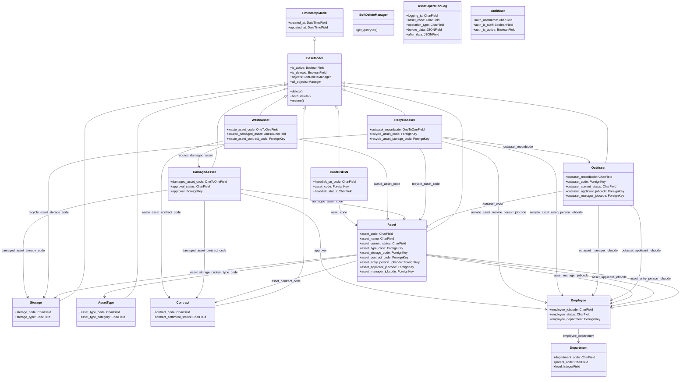
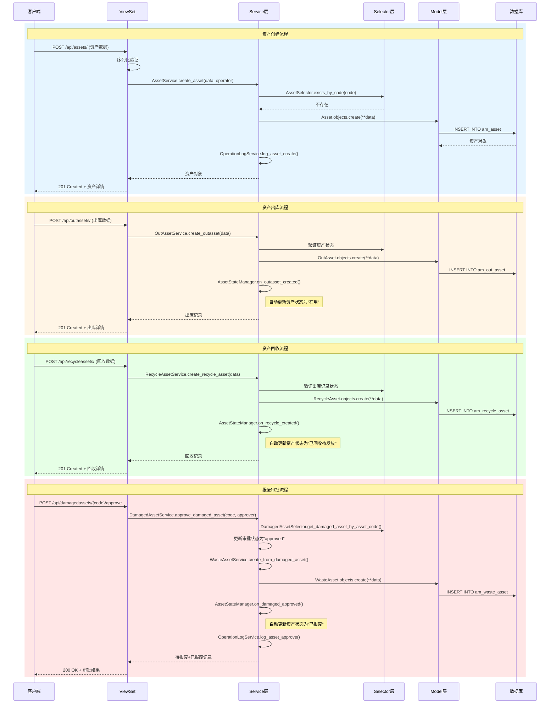
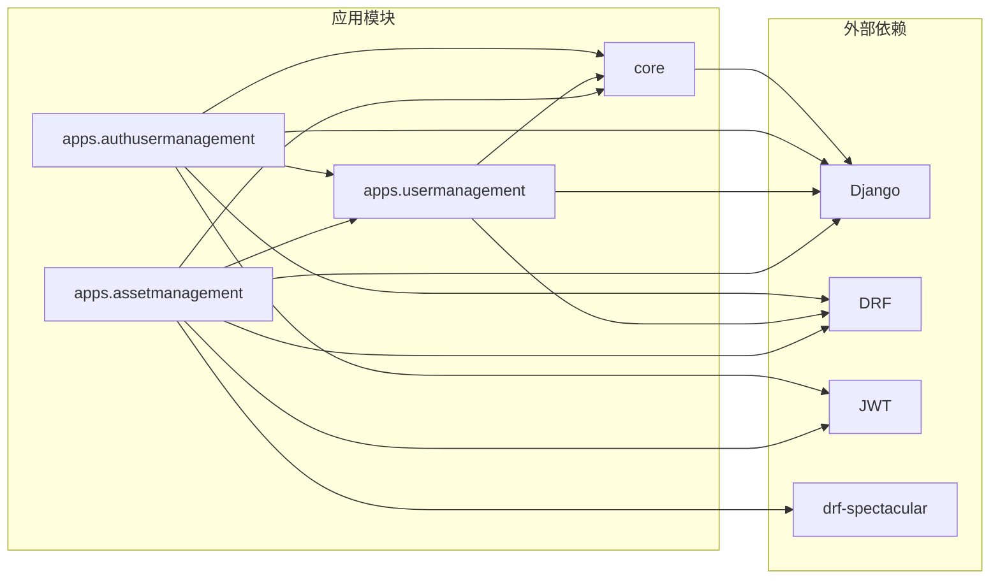
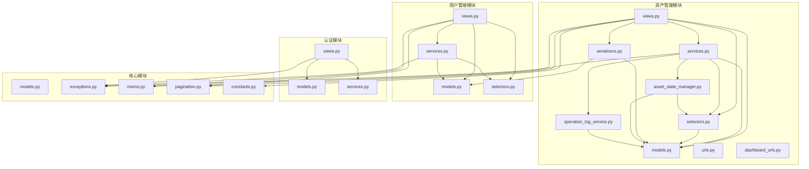

# 资产管理系统 - 代码知识图谱

> 生成时间: 2026-05-25  
> 分析范围: 完整项目代码库  
> 架构风格: Django REST Framework + Service/Selector 分层架构

---

## 一、架构概览

```mermaid
graph TB
    subgraph 客户端层
        WEB[Web前端]
        CLI[命令行工具]
    end

    subgraph API网关层
        URLS[URL路由配置<br/>config/urls.py]
        AUTH[JWT认证<br/>rest_framework_simplejwt]
        PERM[权限控制<br/>IsAuthenticated]
    end

    subgraph 应用层
        subgraph 资产管理
            AV[AssetViewSet]
            OV[OutAssetViewSet]
            RV[RecycleAssetViewSet]
            DV[DamagedAssetViewSet]
            WV[WasteAssetViewSet]
            HV[HardDiskSNViewSet]
            DBV[DashboardViewSet]
        end
        subgraph 用户管理
            UV[UserManagement<br/>DepartmentViewSet<br/>EmployeeViewSet]
        end
        subgraph 认证管理
            AUV[AuthUserViewSet<br/>LoginAPIView<br/>RegisterAPIView]
        end
    end

    subgraph 服务层
        AS[AssetService]
        OS[OutAssetService]
        RS[RecycleAssetService]
        DS[DamagedAssetService]
        WS[WasteAssetService]
        CS[ContractService]
        SS[StorageService]
        ATS[AssetTypeService]
        ES[EmployeeService]
        DTS[DepartmentService]
        AUS[AuthService]
        OLS[OperationLogService]
        ASM[AssetStateManager]
    end

    subgraph 查询层
        ASEL[AssetSelector]
        OSEL[OutAssetSelector]
        RSEL[RecycleAssetSelector]
        DSEL[DamagedAssetSelector]
        WSEL[WasteAssetSelector]
        CSEL[ContractSelector]
        SSEL[StorageSelector]
        ATSEL[AssetTypeSelector]
        ESEL[EmployeeSelector]
        DSEL2[DepartmentSelector]
        HSEL[HardDiskSNSelector]
        DBSEL[DashboardSelector]
    end

    subgraph 数据层
        subgraph 核心模型
            AM[Asset<br/>资产主表]
            OM[OutAsset<br/>出库记录]
            RM[RecycleAsset<br/>回收记录]
            DM[DamagedAsset<br/>待报废]
            WM[WasteAsset<br/>已报废]
            HM[HardDiskSN<br/>硬盘序列号]
        end
        subgraph 基础数据
            STM[Storage<br/>仓库]
            ATM[AssetType<br/>资产类型]
            CM[Contract<br/>合同]
        end
        subgraph 组织架构
            EM[Employee<br/>员工]
            DM2[Department<br/>部门]
        end
        subgraph 认证
            AUM[AuthUser<br/>认证用户]
            AOL[AssetOperationLog<br/>操作日志]
        end
        subgraph 基础抽象
            BM[BaseModel<br/>软删除/时间戳]
            TSM[TimestampModel]
            SDM[SoftDeleteManager]
        end
    end

    WEB --> URLS
    CLI --> URLS
    URLS --> AV
    URLS --> UV
    URLS --> AUV
    URLS --> OV
    URLS --> RV
    URLS --> DV
    URLS --> WV
    URLS --> HV
    URLS --> DBV

    AV --> AS
    OV --> OS
    RV --> RS
    DV --> DS
    WV --> WS
    AV --> CS
    AV --> SS
    AV --> ATS
    UV --> ES
    UV --> DTS
    AUV --> AUS
    AV --> OLS

    AS --> ASEL
    OS --> OSEL
    RS --> RSEL
    DS --> DSEL
    WS --> WSEL
    CS --> CSEL
    SS --> SSEL
    ATS --> ATSEL
    ES --> ESEL
    DTS --> DSEL2

    AS --> ASM
    OS --> ASM
    RS --> ASM
    DS --> ASM
    WS --> ASM

    ASEL --> AM
    OSEL --> OM
    RSEL --> RM
    DSEL --> DM
    WSEL --> WM
    CSEL --> CM
    SSEL --> STM
    ATSEL --> ATM
    ESEL --> EM
    DSEL2 --> DM2
    HSEL --> HM

    AM --> BM
    OM --> BM
    RM --> BM
    DM --> BM
    WM --> BM
    STM --> BM
    ATM --> BM
    CM --> BM
    HM --> BM
    AOL --> TSM

    AM --> EM
    OM --> EM
    RM --> EM
    DM --> EM
    AM --> STM
    AM --> ATM
    AM --> CM
    OM --> CM
    RM --> STM
    DM --> STM
    WM --> CM
    HM --> AM
    EM --> DM2
    AOL --> AM
```

---

## 二、核心实体定义

### 2.1 模型层实体 (Models)

| 实体名称 | 类型 | 职责 | 关键字段 |
|---------|------|------|---------|
| **BaseModel** | 抽象基类 | 提供软删除、时间戳、激活状态 | `is_deleted`, `is_active`, `created_at`, `updated_at` |
| **TimestampModel** | 抽象基类 | 提供创建/更新时间戳 | `created_at`, `updated_at` |
| **SoftDeleteManager** | 管理器 | 自动过滤已删除记录 | `get_queryset()` 过滤 `is_deleted=False` |
| **Asset** | 核心实体 | 资产主表，全生命周期管理 | `asset_code`, `asset_current_status`, `asset_type_code`, `asset_storage_code` |
| **OutAsset** | 核心实体 | 资产出库记录 | `outasset_recordcode`, `outasset_code`, `outasset_current_status` |
| **RecycleAsset** | 核心实体 | 资产回收记录 | `recycle_asset_code`, `outasset_recordcode` |
| **DamagedAsset** | 核心实体 | 待报废资产 | `damaged_asset_code`, `approval_status` |
| **WasteAsset** | 核心实体 | 已报废资产 | `waste_asset_code`, `source_damaged_asset` |
| **HardDiskSN** | 核心实体 | 硬盘序列号管理 | `harddisk_sn_code`, `asset_code`, `harddisk_status` |
| **Storage** | 基础实体 | 仓库管理 | `storage_code`, `storage_type` |
| **AssetType** | 基础实体 | 资产类型 | `asset_type_code`, `asset_type_category` |
| **Contract** | 基础实体 | 合同管理 | `contract_code`, `contract_settlment_status` |
| **Employee** | 组织实体 | 员工管理 | `employee_jobcode`, `employee_status` |
| **Department** | 组织实体 | 部门管理(树形结构) | `department_code`, `parent_code`, `level` |
| **AuthUser** | 认证实体 | 用户认证 | `auth_username`, `auth_is_staff`, `auth_is_active` |
| **AssetOperationLog** | 审计实体 | 操作日志(只读) | `logging_id`, `operation_type`, `before_data`, `after_data` |

### 2.2 服务层实体 (Services)

| 服务名称 | 职责 | 关键方法 |
|---------|------|---------|
| **AssetService** | 资产管理核心业务逻辑 | `create_asset()`, `update_asset()`, `delete_asset()`, `change_asset_status()` |
| **OutAssetService** | 出库业务逻辑 | `create_outasset()`, `update_outasset()` |
| **RecycleAssetService** | 回收业务逻辑 | `create_recycle_asset()` |
| **DamagedAssetService** | 报废申请与审批 | `create_damaged_asset()`, `approve_damaged_asset()`, `reject_damaged_asset()` |
| **WasteAssetService** | 报废执行 | `create_waste_asset()`, `create_from_damaged_asset()` |
| **ContractService** | 合同管理 | `add_payment_record()`, `update_settlement_status()` |
| **StorageService** | 仓库管理 | `create_storage()` |
| **AssetTypeService** | 资产类型管理 | `create_asset_type()` |
| **EmployeeService** | 员工管理 | `create_employee()`, `change_employee_status()` |
| **DepartmentService** | 部门管理 | `move_department()`, `batch_update_sort_order()` |
| **AuthService** | 认证服务 | `authenticate_user()`, `logout_user()` |
| **OperationLogService** | 操作日志记录 | `log_asset_create()`, `log_asset_update()`, `log_operation()` |
| **AssetStateManager** | 状态机管理 | `on_outasset_created()`, `on_recycle_created()`, `on_damaged_created()` |

### 2.3 查询层实体 (Selectors)

| 选择器名称 | 职责 | 关键方法 |
|-----------|------|---------|
| **AssetSelector** | 资产查询 | `get_asset_by_code()`, `search_assets()`, `get_available_assets()` |
| **OutAssetSelector** | 出库查询 | `get_outasset_by_record_code()`, `get_recyclable_outassets()` |
| **RecycleAssetSelector** | 回收查询 | `get_recycle_assets_by_asset()`, `get_recycle_asset_by_outasset_code()` |
| **DamagedAssetSelector** | 待报废查询 | `get_damaged_asset_by_asset_code()`, `exists_by_asset_code()` |
| **WasteAssetSelector** | 已报废查询 | `get_waste_asset_by_asset_code()`, `get_waste_assets_by_date_range()` |
| **ContractSelector** | 合同查询 | `get_contract_by_code()`, `search_contracts()` |
| **StorageSelector** | 仓库查询 | `get_storage_by_code()`, `exists_by_code()` |
| **AssetTypeSelector** | 资产类型查询 | `get_asset_type_by_code()`, `exists_by_code()` |
| **EmployeeSelector** | 员工查询 | `get_employee_by_jobcode()`, `search_employees()` |
| **DepartmentSelector** | 部门查询 | `build_department_tree()`, `get_department_path()` |
| **HardDiskSNSelector** | 硬盘查询 | `get_harddisk_sn_by_code()`, `get_harddisk_sns_by_asset()` |
| **DashboardSelector** | 仪表盘查询 | `get_overview_statistics()`, `get_recent_out_assets()` |

### 2.4 视图层实体 (Views)

| 视图集名称 | 职责 | 继承关系 |
|-----------|------|---------|
| **AssetViewSet** | 资产CRUD + 自定义查询 | `LoggingMixin`, `ResponseWrapperMixin`, `ModelViewSet` |
| **OutAssetViewSet** | 出库CRUD + 回收查询 | `LoggingMixin`, `ResponseWrapperMixin`, `ModelViewSet` |
| **RecycleAssetViewSet** | 回收CRUD | `LoggingMixin`, `ResponseWrapperMixin`, `ModelViewSet` |
| **DamagedAssetViewSet** | 待报废CRUD + 审批 | `LoggingMixin`, `ResponseWrapperMixin`, `ModelViewSet` |
| **WasteAssetViewSet** | 已报废查询 | `LoggingMixin`, `ResponseWrapperMixin`, `ModelViewSet` |
| **HardDiskSNViewSet** | 硬盘序列号管理 | `LoggingMixin`, `ResponseWrapperMixin`, `ModelViewSet` |
| **StorageViewSet** | 仓库管理 | `LoggingMixin`, `ResponseWrapperMixin`, `ModelViewSet` |
| **AssetTypeViewSet** | 资产类型管理 | `LoggingMixin`, `ResponseWrapperMixin`, `ModelViewSet` |
| **ContractViewSet** | 合同管理 | `LoggingMixin`, `ResponseWrapperMixin`, `ModelViewSet` |
| **DashboardViewSet** | 仪表盘统计 | `LoggingMixin`, `ResponseWrapperMixin`, `ViewSet` |
| **DepartmentViewSet** | 部门管理(树形) | `LoggingMixin`, `ResponseWrapperMixin`, `ModelViewSet` |
| **EmployeeViewSet** | 员工管理 | `LoggingMixin`, `ResponseWrapperMixin`, `ModelViewSet` |
| **AuthUserViewSet** | 用户CRUD | `ModelViewSet` |
| **LoginAPIView** | 登录接口 | `APIView` |
| **RegisterAPIView** | 注册接口 | `APIView` |
| **UserProfileAPIView** | 用户信息 | `APIView` |
| **LogoutAPIView** | 退出登录 | `APIView` |

---

## 三、实体关系图谱

### 3.1 类继承关系

### 3.2 调用关系图 (Service层)

```mermaid
flowchart TD
    subgraph View调用
        V1[AssetViewSet.create]
        V2[AssetViewSet.update]
        V3[AssetViewSet.destroy]
        V4[OutAssetViewSet.create]
        V5[RecycleAssetViewSet.create]
        V6[DamagedAssetViewSet.approve]
        V7[DamagedAssetViewSet.reject]
    end
    
    subgraph Service层
        S1[AssetService.create_asset]
        S2[AssetService.update_asset]
        S3[AssetService.delete_asset]
        S4[OutAssetService.create_outasset]
        S5[RecycleAssetService.create_recycle_asset]
        S6[DamagedAssetService.approve_damaged_asset]
        S7[DamagedAssetService.reject_damaged_asset]
        S8[DamagedAssetService.create_damaged_asset]
        S9[WasteAssetService.create_from_damaged_asset]
        S10[OperationLogService.log_operation]
        S11[AssetStateManager.on_outasset_created]
        S12[AssetStateManager.on_recycle_created]
        S13[AssetStateManager.on_damaged_created]
    end
    
    subgraph Selector层
        SEL1[AssetSelector.get_asset_by_code]
        SEL2[AssetSelector.exists_by_code]
        SEL3[OutAssetSelector.get_outasset_by_record_code]
        SEL4[DamagedAssetSelector.get_damaged_asset_by_asset_code]
        SEL5[WasteAssetSelector.get_waste_asset_by_asset_code]
    end
    
    subgraph Model层
        M1[Asset.objects.create]
        M2[Asset.save]
        M3[OutAsset.objects.create]
        M4[RecycleAsset.objects.create]
        M5[DamagedAsset.objects.create]
        M6[WasteAsset.objects.create]
        M7[AssetOperationLog.objects.create]
    end
    
    V1 --> S1
    V2 --> S2
    V3 --> S3
    V4 --> S4
    V5 --> S5
    V6 --> S6
    V7 --> S7
    
    S1 --> SEL2
    S1 --> M1
    S1 --> S10
    
    S2 --> SEL1
    S2 --> M2
    S2 --> S10
    
    S3 --> SEL1
    S3 --> S10
    
    S4 --> SEL3
    S4 --> M3
    S4 --> S11
    
    S5 --> SEL3
    S5 --> M4
    S5 --> S12
    
    S6 --> SEL4
    S6 --> S9
    S6 --> S10
    
    S7 --> SEL4
    S7 --> S10
    
    S8 --> SEL1
    S8 --> M5
    S8 --> S13
    
    S9 --> SEL5
    S9 --> M6
```

### 3.3 数据流向图

---

## 四、模块依赖关系

### 4.1 应用间依赖

### 4.2 文件导入关系

---

## 五、API路由结构

```mermaid
graph TD
    ROOT["/"] --> API_ROOT[api_root]
    ROOT --> ADMIN["/admin/"]
    
    ROOT --> AUTH["/api/auth/"]
    ROOT --> USERS["/api/users/"]
    ROOT --> ASSETS["/api/assets/"]
    ROOT --> DASHBOARD["/api/dashboard/"]
    ROOT --> SCHEMA["/api/schema/"]
    ROOT --> SWAGGER["/api/swagger/"]
    ROOT --> REDOC["/api/redoc/"]
    
    AUTH --> AUTH_URLS[authusermanagement.urls]
    AUTH_URLS --> LOGIN[LoginAPIView]
    AUTH_URLS --> REGISTER[RegisterAPIView]
    AUTH_URLS --> PROFILE[UserProfileAPIView]
    AUTH_URLS --> LOGOUT[LogoutAPIView]
    AUTH_URLS --> USERS_CRUD[AuthUserViewSet]
    
    USERS --> USER_URLS[usermanagement.urls]
    USER_URLS --> DEPT[DepartmentViewSet]
    USER_URLS --> EMP[EmployeeViewSet]
    
    ASSETS --> ASSET_URLS[assetmanagement.urls]
    ASSET_URLS --> STORAGE[StorageViewSet]
    ASSET_URLS --> ASSET_TYPE[AssetTypeViewSet]
    ASSET_URLS --> CONTRACT[ContractViewSet]
    ASSET_URLS --> ASSET[AssetViewSet]
    ASSET_URLS --> OUTASSET[OutAssetViewSet]
    ASSET_URLS --> RECYCLE[RecycleAssetViewSet]
    ASSET_URLS --> DAMAGED[DamagedAssetViewSet]
    ASSET_URLS --> WASTE[WasteAssetViewSet]
    ASSET_URLS --> HARDDISK[HardDiskSNViewSet]
    
    DASHBOARD --> DASH_URLS[assetmanagement.dashboard_urls]
    DASH_URLS --> DASH_VIEW[DashboardViewSet]
```

---

## 六、架构洞察总结

### 6.1 核心架构特点

1. **分层架构清晰**
   - **View层**: 处理HTTP请求/响应，使用DRF的ViewSet
   - **Service层**: 封装核心业务逻辑，所有写操作使用事务装饰器
   - **Selector层**: 封装查询逻辑，统一处理软删除过滤和关联预加载
   - **Model层**: 数据实体，继承BaseModel获得软删除和时间戳功能

2. **Service/Selector模式**
   - 遵循AGENTS规范，明确区分写操作(Service)和读操作(Selector)
   - Service层处理业务规则、事务、状态变更
   - Selector层处理查询优化、过滤、排序

3. **状态机驱动**
   - 资产全生命周期通过`AssetStateManager`管理
   - 状态流转: `in_store` → `in_use` → `recycled_pending` → `in_use` / `damaged` → `scrapped`
   - 状态变更通过Service层显式调用，而非Signal隐式触发

4. **审计日志完整**
   - `AssetOperationLog`记录所有资产操作
   - 只读表设计，禁止修改和删除
   - 记录变更前后数据(JSON格式)，支持完整审计追踪

5. **软删除机制**
   - `BaseModel`提供`is_deleted`字段
   - `SoftDeleteManager`自动过滤已删除记录
   - 支持`hard_delete()`物理删除和`restore()`恢复

### 6.2 潜在耦合点

| 耦合点 | 位置 | 说明 | 建议 |
|-------|------|------|------|
| **跨应用导入** | Asset序列化器导入Employee | `apps.assetmanagement.serializers` 导入 `apps.usermanagement.models.Employee` | 可考虑通过接口解耦 |
| **状态机与Service** | AssetStateManager被多处调用 | 状态变更逻辑分散在多个Service中 | 考虑将状态流转规则集中管理 |
| **操作日志与Service** | OperationLogService在Service中被直接调用 | 日志记录与业务逻辑耦合 | 可考虑使用Signal或中间件解耦 |
| **硬编码字段名** | ASSET_UPDATE_ALLOWED_FIELDS | 可更新字段白名单硬编码 | 可考虑从模型元数据动态生成 |

### 6.3 主要入口职责

| 入口 | 职责 | 关键文件 |
|-----|------|---------|
| **URL配置** | 路由分发、API文档 | `config/urls.py` |
| **资产管理** | 资产全生命周期管理 | `apps/assetmanagement/views.py` |
| **用户认证** | JWT认证、用户管理 | `apps/authusermanagement/views.py` |
| **组织架构** | 部门树、员工管理 | `apps/usermanagement/views.py` |
| **核心业务逻辑** | 资产状态流转、审批流程 | `apps/assetmanagement/services.py` |
| **数据查询** | 复杂查询封装、性能优化 | `apps/assetmanagement/selectors.py` |

### 6.4 数据流特点

1. **写入流程**: View → Service → Model → DB
   - Service层统一处理事务
   - 状态变更通过AssetStateManager
   - 操作日志同步记录

2. **查询流程**: View → Selector → Model → DB
   - Selector自动过滤软删除
   - 使用select_related预加载关联
   - 返回QuerySet或单个对象

3. **审批流程**: 
   - DamagedAsset审批通过 → 自动创建WasteAsset
   - 状态联动更新(Asset + OutAsset)
   - 操作日志记录审批结果

---

## 七、知识图谱统计

| 类别 | 数量 |
|-----|------|
| **模型类** | 15个 |
| **服务类** | 13个 |
| **选择器类** | 12个 |
| **视图集** | 17个 |
| **应用模块** | 3个 |
| **核心工具类** | 5个 |
| **外键关系** | 35个 |
| **继承关系** | 12个 |

---

*文档生成完成 - 资产管理系统代码知识图谱*
