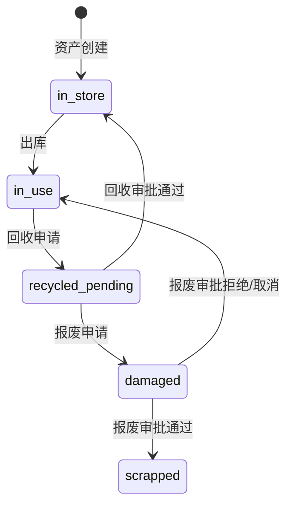

# 资产管理系统解耦方案

> **文档状态**: 待审查  
> **创建日期**: 2026-05-25  
> **适用范围**: 按照AGENTS规范审查后的四个关键耦合点

---

## 目录

1. [方案概述](#方案概述)
2. [耦合点1: 跨应用导入](#耦合点1-跨应用导入)
3. [耦合点2: 状态机与Service耦合](#耦合点2-状态机与service耦合)
4. [耦合点3: 操作日志与Service耦合](#耦合点3-操作日志与service耦合)
5. [耦合点4: 硬编码字段白名单](#耦合点4-硬编码字段白名单)
6. [实施优先级建议](#实施优先级建议)
7. [风险评估](#风险评估)

---

## 方案概述

### 当前耦合问题总览

| 耦合点 | 位置 | 严重程度 | 影响范围 |
|--------|------|----------|----------|
| 跨应用导入 | serializers.py | 中 | 资产序列化器与员工模块 |
| 状态机分散 | asset_state_manager.py | 高 | 所有资产状态变更 |
| 操作日志耦合 | services.py | 中 | 所有Service类 |
| 硬编码字段 | services.py | 低 | 字段更新白名单 |

### 解耦原则

1. **依赖倒置**: 高层模块不依赖低层模块，两者都依赖抽象
2. **单一职责**: 每个类/模块只负责一个明确职责
3. **开闭原则**: 对扩展开放，对修改关闭
4. **显式优于隐式**: 避免魔法，依赖关系清晰可见

---

## 耦合点1: 跨应用导入

### 现状分析

**位置**: `apps/assetmanagement/serializers.py` 第31-32行

```python
from apps.usermanagement.models import Employee
from apps.usermanagement.serializers import EmployeeSerializer
```

**使用场景**:
- `AssetCreateSerializer`: `asset_management_person` 字段使用 `Employee.objects.all()` 作为queryset
- `OutAssetSerializer`: `outasset_manager` 字段使用 `Employee.objects.all()` 作为queryset
- `OutAssetDetailSerializer`: 嵌套序列化 `EmployeeSerializer`
- `RecycleAssetSerializer`: `recycle_asset_using_person` 字段使用 `Employee.objects.all()` 作为queryset

### 解耦方案

#### 方案A: 接口契约解耦（推荐）

**核心思想**: 通过抽象接口定义员工数据契约，资产模块不直接依赖员工模块的具体实现。

**实施步骤**:

1. **定义抽象接口** (`apps/assetmanagement/interfaces.py`)

```python
from abc import ABC, abstractmethod
from typing import List, Dict, Any, Optional

class EmployeeProvider(ABC):
    """
    员工数据提供者接口
    
    定义资产模块所需的员工数据契约，实现依赖倒置原则。
    """
    
    @abstractmethod
    def get_all_employees(self) -> List[Dict[str, Any]]:
        """获取所有员工列表"""
        pass
    
    @abstractmethod
    def get_employee_by_jobcode(self, jobcode: str) -> Optional[Dict[str, Any]]:
        """根据工号获取员工信息"""
        pass
    
    @abstractmethod
    def get_employee_display_name(self, jobcode: str) -> str:
        """获取员工显示名称"""
        pass


class EmployeeSerializerProvider(ABC):
    """员工序列化器提供者接口"""
    
    @abstractmethod
    def get_serializer_class(self):
        """返回员工序列化器类"""
        pass
```

2. **实现提供者** (`apps/usermanagement/providers.py`)

```python
from apps.assetmanagement.interfaces import EmployeeProvider, EmployeeSerializerProvider
from apps.usermanagement.models import Employee
from apps.usermanagement.serializers import EmployeeSerializer

class DjangoEmployeeProvider(EmployeeProvider):
    """Django ORM实现的员工数据提供者"""
    
    def get_all_employees(self):
        return list(Employee.objects.filter(is_deleted=False).values(
            'employee_jobcode', 'employee_name', 'employee_department'
        ))
    
    def get_employee_by_jobcode(self, jobcode: str):
        try:
            employee = Employee.objects.get(employee_jobcode=jobcode, is_deleted=False)
            return {
                'employee_jobcode': employee.employee_jobcode,
                'employee_name': employee.employee_name,
                'employee_department': employee.employee_department,
            }
        except Employee.DoesNotExist:
            return None
    
    def get_employee_display_name(self, jobcode: str) -> str:
        employee = self.get_employee_by_jobcode(jobcode)
        if employee:
            return f"{employee['employee_name']}({jobcode})"
        return jobcode


class DjangoEmployeeSerializerProvider(EmployeeSerializerProvider):
    """Django员工序列化器提供者"""
    
    def get_serializer_class(self):
        return EmployeeSerializer
```

3. **配置依赖注入** (`config/dependencies.py`)

```python
from apps.assetmanagement.interfaces import EmployeeProvider, EmployeeSerializerProvider
from apps.usermanagement.providers import DjangoEmployeeProvider, DjangoEmployeeSerializerProvider

# 依赖注入容器
class DependencyContainer:
    _instance = None
    
    def __new__(cls):
        if cls._instance is None:
            cls._instance = super().__new__(cls)
            cls._instance._providers = {}
            cls._instance._register_defaults()
        return cls._instance
    
    def _register_defaults(self):
        """注册默认实现"""
        self._providers[EmployeeProvider] = DjangoEmployeeProvider()
        self._providers[EmployeeSerializerProvider] = DjangoEmployeeSerializerProvider()
    
    def register(self, interface, implementation):
        """注册接口实现"""
        self._providers[interface] = implementation
    
    def resolve(self, interface):
        """解析接口实现"""
        if interface not in self._providers:
            raise KeyError(f"未找到接口 {interface.__name__} 的实现")
        return self._providers[interface]


# 全局访问点
def get_container() -> DependencyContainer:
    return DependencyContainer()
```

4. **修改序列化器** (`apps/assetmanagement/serializers.py`)

```python
from apps.assetmanagement.interfaces import EmployeeProvider, EmployeeSerializerProvider
from config.dependencies import get_container

class AssetCreateSerializer(serializers.ModelSerializer):
    """资产创建序列化器"""
    
    asset_management_person = serializers.SlugRelatedField(
        slug_field='employee_jobcode',
        queryset=None,  # 动态设置
        required=False,
        allow_null=True
    )
    
    def __init__(self, *args, **kwargs):
        super().__init__(*args, **kwargs)
        # 延迟加载queryset
        provider = get_container().resolve(EmployeeProvider)
        # 注意：实际实现需要适配Django REST Framework的queryset要求
        # 这里展示解耦思路，具体实现需要进一步封装
```

**优点**:
- 完全解耦两个应用，符合依赖倒置原则
- 便于单元测试（可注入Mock实现）
- 支持未来替换员工模块实现

**缺点**:
- 引入额外复杂度
- 需要适配DRF的序列化器机制
- 初期改造成本较高

#### 方案B: 配置化字段映射（折中方案）

**核心思想**: 通过Django settings配置字段映射，减少硬编码依赖。

**实施步骤**:

1. **配置映射关系** (`config/settings.py`)

```python
# 资产模块员工字段配置
ASSET_EMPLOYEE_CONFIG = {
    'model': 'usermanagement.Employee',
    'serializer': 'usermanagement.serializers.EmployeeSerializer',
    'fields': {
        'jobcode': 'employee_jobcode',
        'name': 'employee_name',
        'department': 'employee_department',
    },
    'queryset_filter': {'is_deleted': False},
}
```

2. **创建动态字段工具** (`apps/assetmanagement/fields.py`)

```python
from django.utils.module_loading import import_string
from django.conf import settings
from rest_framework import serializers

def get_employee_queryset():
    """动态获取员工queryset"""
    config = settings.ASSET_EMPLOYEE_CONFIG
    model_path = config['model']
    app_label, model_name = model_path.split('.')
    model = apps.get_model(app_label, model_name)
    
    queryset = model.objects.all()
    filter_kwargs = config.get('queryset_filter', {})
    if filter_kwargs:
        queryset = queryset.filter(**filter_kwargs)
    return queryset


def get_employee_serializer():
    """动态获取员工序列化器"""
    config = settings.ASSET_EMPLOYEE_CONFIG
    return import_string(config['serializer'])


class DynamicEmployeeField(serializers.SlugRelatedField):
    """动态员工字段"""
    
    def __init__(self, **kwargs):
        self.config = settings.ASSET_EMPLOYEE_CONFIG
        slug_field = self.config['fields']['jobcode']
        super().__init__(slug_field=slug_field, queryset=get_employee_queryset(), **kwargs)
```

3. **修改序列化器**

```python
from apps.assetmanagement.fields import DynamicEmployeeField, get_employee_serializer

class AssetCreateSerializer(serializers.ModelSerializer):
    asset_management_person = DynamicEmployeeField(required=False, allow_null=True)
    # ... 其他字段
```

**优点**:
- 配置化，减少硬编码
- 实现相对简单
- 保留Django ORM的便利性

**缺点**:
- 仍然存在运行时依赖
- 配置错误可能导致运行时错误

#### 方案C: 保持现状 + 文档约束（保守方案）

**核心思想**: 承认耦合存在，通过文档和代码规范约束使用方式。

**实施步骤**:

1. **添加文档注释**

```python
# 【耦合点说明】
# 本模块依赖 usermanagement.Employee 模型
# 如果员工模块变更，需要同步更新以下字段：
# - AssetCreateSerializer.asset_management_person
# - OutAssetSerializer.outasset_manager
# - RecycleAssetSerializer.recycle_asset_using_person
# 变更影响范围：资产创建、出库、回收流程
from apps.usermanagement.models import Employee
```

2. **创建依赖检查脚本**

```python
# scripts/check_dependencies.py

def check_asset_user_dependency():
    """检查资产-用户模块耦合"""
    try:
        from apps.usermanagement.models import Employee
        # 检查必要的字段是否存在
        required_fields = ['employee_jobcode', 'employee_name', 'is_deleted']
        for field in required_fields:
            if not hasattr(Employee, field):
                print(f"警告: Employee 缺少字段 {field}")
    except ImportError as e:
        print(f"错误: 无法导入 Employee 模型: {e}")
```

**优点**:
- 改动最小
- 风险最低
- 快速实施

**缺点**:
- 未真正解耦
- 技术债务累积

### 推荐方案

**短期**: 采用方案C + 部分方案B（配置化字段映射），在保持兼容性的前提下降低耦合度。

**长期**: 当系统需要支持多种员工数据源或需要更彻底的模块化时，迁移到方案A（接口契约解耦）。

---

## 耦合点2: 状态机与Service耦合

### 现状分析

**位置**: `apps/assetmanagement/asset_state_manager.py`

**当前实现**:
- `AssetStateManager` 是一个静态工具类
- 被多处调用：`OutAssetService.create_outasset()`、`RecycleAssetService.create_recycle_asset()` 等
- 状态流转规则分散在各Service方法中

**问题**:
1. 状态流转规则不集中，难以维护和审计
2. 新增状态需要修改多处代码
3. 状态变更与业务逻辑耦合
4. 缺乏统一的状态变更历史追踪

### 解耦方案

#### 方案A: 状态机模式重构（推荐）

**核心思想**: 引入有限状态机(FSM)模式，将状态流转规则集中管理。

**实施步骤**:

1. **定义状态机核心** (`apps/assetmanagement/state_machine/core.py`)

```python
from enum import Enum, auto
from typing import Dict, List, Callable, Optional, Any
from dataclasses import dataclass
from datetime import datetime

class AssetState(Enum):
    """资产状态枚举"""
    IN_STORE = "in_store"           # 在库
    IN_USE = "in_use"               # 在用
    RECYCLED_PENDING = "recycled_pending"  # 待回收
    DAMAGED = "damaged"             # 待报废
    SCRAPPED = "scrapped"           # 已报废

class StateTransition:
    """状态转换定义"""
    def __init__(
        self,
        from_state: AssetState,
        to_state: AssetState,
        trigger: str,
        validator: Optional[Callable] = None,
        on_transition: Optional[Callable] = None
    ):
        self.from_state = from_state
        self.to_state = to_state
        self.trigger = trigger
        self.validator = validator
        self.on_transition = on_transition

class AssetStateMachine:
    """
    资产状态机
    
    集中管理所有资产状态流转规则。
    """
    
    def __init__(self):
        self._transitions: Dict[str, List[StateTransition]] = {}
        self._setup_transitions()
    
    def _setup_transitions(self):
        """配置状态流转规则"""
        # 在库 -> 在用 (出库)
        self._add_transition(StateTransition(
            from_state=AssetState.IN_STORE,
            to_state=AssetState.IN_USE,
            trigger="outasset_created",
            validator=self._validate_outasset,
            on_transition=self._on_outasset_created
        ))
        
        # 在用 -> 待回收 (回收)
        self._add_transition(StateTransition(
            from_state=AssetState.IN_USE,
            to_state=AssetState.RECYCLED_PENDING,
            trigger="recycle_created",
            validator=self._validate_recycle,
            on_transition=self._on_recycle_created
        ))
        
        # 待回收 -> 在库 (重新入库)
        self._add_transition(StateTransition(
            from_state=AssetState.RECYCLED_PENDING,
            to_state=AssetState.IN_STORE,
            trigger="recycle_approved",
            on_transition=self._on_recycle_approved
        ))
        
        # 在用/待回收 -> 待报废 (报废申请)
        self._add_transition(StateTransition(
            from_state=AssetState.IN_USE,
            to_state=AssetState.DAMAGED,
            trigger="damaged_created",
            validator=self._validate_damaged,
            on_transition=self._on_damaged_created
        ))
        
        self._add_transition(StateTransition(
            from_state=AssetState.RECYCLED_PENDING,
            to_state=AssetState.DAMAGED,
            trigger="damaged_created",
            validator=self._validate_damaged,
            on_transition=self._on_damaged_created
        ))
        
        # 待报废 -> 已报废 (审批通过)
        self._add_transition(StateTransition(
            from_state=AssetState.DAMAGED,
            to_state=AssetState.SCRAPPED,
            trigger="damaged_approved",
            validator=self._validate_damaged_approved,
            on_transition=self._on_damaged_approved
        ))
        
        # 待报废 -> 原状态 (审批拒绝/取消)
        self._add_transition(StateTransition(
            from_state=AssetState.DAMAGED,
            to_state=AssetState.IN_USE,
            trigger="damaged_rejected",
            on_transition=self._on_damaged_rejected
        ))
    
    def _add_transition(self, transition: StateTransition):
        """添加状态转换规则"""
        key = f"{transition.from_state.value}_{transition.trigger}"
        if key not in self._transitions:
            self._transitions[key] = []
        self._transitions[key].append(transition)
    
    def can_transition(
        self,
        current_state: AssetState,
        trigger: str,
        context: Optional[Dict] = None
    ) -> bool:
        """检查是否可以执行状态转换"""
        key = f"{current_state.value}_{trigger}"
        transitions = self._transitions.get(key, [])
        
        for transition in transitions:
            if transition.validator:
                try:
                    transition.validator(context)
                except Exception:
                    continue
            return True
        return False
    
    def transition(
        self,
        asset: 'Asset',
        trigger: str,
        context: Optional[Dict] = None
    ) -> 'StateTransitionResult':
        """执行状态转换"""
        current_state = AssetState(asset.asset_current_status)
        key = f"{current_state.value}_{trigger}"
        transitions = self._transitions.get(key, [])
        
        if not transitions:
            raise InvalidTransitionError(
                f"无法从 {current_state.value} 通过 {trigger} 转换状态"
            )
        
        # 执行第一个有效的转换
        for transition in transitions:
            if transition.validator:
                try:
                    transition.validator(context)
                except Exception as e:
                    continue
            
            # 执行转换
            old_state = asset.asset_current_status
            asset.asset_current_status = transition.to_state.value
            
            # 调用转换后回调
            if transition.on_transition:
                transition.on_transition(asset, context)
            
            return StateTransitionResult(
                success=True,
                from_state=old_state,
                to_state=transition.to_state.value,
                trigger=trigger
            )
        
        raise InvalidTransitionError("没有通过验证的转换规则")
    
    # 验证器和回调方法...
    def _validate_outasset(self, context):
        """验证出库条件"""
        outasset = context.get('outasset')
        if not outasset:
            raise ValueError("缺少出库记录")
    
    def _on_outasset_created(self, asset, context):
        """出库创建后的处理"""
        outasset = context.get('outasset')
        # 更新出库记录状态等
```

2. **状态历史追踪** (`apps/assetmanagement/state_machine/history.py`)

```python
from django.db import models

class AssetStateHistory(models.Model):
    """资产状态变更历史"""
    asset_code = models.CharField(max_length=100, db_index=True)
    from_state = models.CharField(max_length=50)
    to_state = models.CharField(max_length=50)
    trigger = models.CharField(max_length=100)
    operator_jobcode = models.CharField(max_length=100, null=True)
    operator_name = models.CharField(max_length=100, null=True)
    context_data = models.JSONField(default=dict)
    created_at = models.DateTimeField(auto_now_add=True)
    
    class Meta:
        db_table = 'asset_state_history'
        ordering = ['-created_at']
```

3. **重构后的Service使用** (`apps/assetmanagement/services.py`)

```python
from apps.assetmanagement.state_machine.core import AssetStateMachine, AssetState

class AssetService:
    _state_machine = AssetStateMachine()
    
    @staticmethod
    @transaction.atomic
    def change_asset_status(asset_code: str, new_status: str, trigger: str, operator=None):
        """
        变更资产状态
        
        通过状态机统一管理状态流转。
        """
        asset = AssetSelector.get_asset_by_code(asset_code)
        if not asset:
            raise AppValidationError(detail=f"资产 {asset_code} 不存在")
        
        context = {
            'asset': asset,
            'operator': operator,
            'new_status': new_status
        }
        
        # 使用状态机执行转换
        result = AssetService._state_machine.transition(
            asset=asset,
            trigger=trigger,
            context=context
        )
        
        asset.save()
        
        # 记录状态变更历史
        AssetStateHistory.objects.create(
            asset_code=asset.asset_code,
            from_state=result.from_state,
            to_state=result.to_state,
            trigger=trigger,
            operator_jobcode=operator.get('jobcode') if operator else None,
            operator_name=operator.get('name') if operator else None,
            context_data=context
        )
        
        return asset
```

**优点**:
- 状态流转规则集中，易于维护和审计
- 新增状态只需添加转换规则，符合开闭原则
- 支持状态变更历史追踪
- 便于单元测试（可Mock状态机）

**缺点**:
- 引入新的抽象层，增加复杂度
- 需要重构现有代码

#### 方案B: 事件驱动状态管理

**核心思想**: 使用Django Signal或事件总线解耦状态变更。

**实施步骤**:

1. **定义状态事件** (`apps/assetmanagement/events.py`)

```python
from dataclasses import dataclass
from typing import Optional, Dict, Any

@dataclass
class AssetStateChangeEvent:
    """资产状态变更事件"""
    asset_code: str
    from_state: str
    to_state: str
    trigger: str
    operator_jobcode: Optional[str] = None
    operator_name: Optional[str] = None
    context: Optional[Dict[str, Any]] = None
```

2. **事件发布者** (`apps/assetmanagement/state_publisher.py`)

```python
from django.dispatch import Signal

# 定义状态变更信号
asset_state_changed = Signal()

class AssetStatePublisher:
    """资产状态事件发布者"""
    
    @staticmethod
    def publish_state_change(event: AssetStateChangeEvent):
        """发布状态变更事件"""
        asset_state_changed.send(
            sender=AssetStatePublisher,
            event=event
        )
```

3. **事件订阅者** (`apps/assetmanagement/state_subscribers.py`)

```python
from apps.assetmanagement.state_publisher import asset_state_changed

@receiver(asset_state_changed)
def handle_asset_state_change(sender, event, **kwargs):
    """处理资产状态变更"""
    # 记录操作日志
    OperationLogService.log_state_change(event)
    
    # 发送通知
    NotificationService.notify_state_change(event)
    
    # 其他业务处理...
```

**优点**:
- 完全解耦状态变更与业务逻辑
- 支持异步处理
- 易于扩展新的事件处理器

**缺点**:
- 调试困难（隐式调用链）
- 需要处理事务一致性
- 过度使用Signal可能导致代码难以追踪

#### 方案C: 保持现状 + 规则文档化

**核心思想**: 保持现有实现，通过文档和注释明确状态流转规则。

**实施步骤**:

1. **创建状态流转图文档**

```python
# apps/assetmanagement/STATE_DIAGRAM.md
"""
资产状态流转图



状态流转规则:
1. in_store -> in_use: 出库创建时自动转换
2. in_use -> recycled_pending: 回收创建时自动转换
3. recycled_pending -> in_store: 回收审批通过后转换
4. recycled_pending -> damaged: 报废申请创建时转换（in_use须先回收至recycled_pending）
5. damaged -> scrapped: 报废审批通过后转换
6. damaged -> in_use: 报废审批拒绝或取消时转换
"""
```

2. **添加代码注释**

```python
class AssetStateManager:
    """
    资产状态管理器
    
    【状态流转规则】
    详见 STATE_DIAGRAM.md
    
    【注意】新增状态流转需要同步更新:
    1. 本类中的处理方法
    2. STATE_DIAGRAM.md 文档
    3. 单元测试
    """
```

**优点**:
- 改动最小
- 快速实施

**缺点**:
- 未真正解决耦合问题
- 技术债务累积

### 推荐方案

**采用方案A（状态机模式重构）**，理由：
1. 资产状态流转是核心业务逻辑，值得投入重构
2. 当前分散的状态管理已经导致维护困难
3. 状态机模式能显著提高代码可维护性
4. 支持未来的复杂业务场景（如审批工作流）

---

## 耦合点3: 操作日志与Service耦合

### 现状分析

**位置**: `apps/assetmanagement/services.py` 多处调用

**当前实现**:
```python
from apps.assetmanagement.operation_log_service import OperationLogService

# 在Service方法中直接调用
OperationLogService.log_asset_create(asset=asset, ...)
OperationLogService.log_asset_update(asset=asset, ...)
OperationLogService.log_operation(asset_code=asset.asset_code, ...)
```

**问题**:
1. 日志记录与业务逻辑紧密耦合
2. 每个Service方法都需要显式调用日志方法
3. 新增业务操作容易遗漏日志记录
4. 日志记录失败可能影响主业务流程

### 解耦方案

#### 方案A: 显式审计上下文 + 装饰器模式（推荐）

**核心思想**: 使用显式的上下文管理器和装饰器，保持调用链清晰可见，避免Signal的隐式调用问题。

**设计原则**:
- **显式优于隐式**: 日志记录代码就在业务代码旁边，一眼可见
- **简约至上**: 不引入复杂的抽象层，使用Python原生语法
- **精确编辑**: 只改要改的地方，保持原有Service结构

**实施步骤**:

1. **定义审计模块** (`apps/assetmanagement/audit.py`)

```python
"""
操作审计模块

【AGENTS规范】显式审计机制，替代Signal隐式调用。

设计原则:
1. 显式调用 - 代码路径清晰可见
2. 简约实现 - 使用标准Python语法，无魔法
3. 事务安全 - 日志记录与业务逻辑在同一事务中

使用方法:
    # 方式1: 显式调用
    AuditLogger.log_asset_create(asset, operator)
    
    # 方式2: 上下文管理器
    with AuditContext('update', asset_code) as ctx:
        asset.save()
        AuditLogger.log_asset_update(asset, before, after, operator)
    
    # 方式3: 装饰器（简单场景）
    @audit_operation('create')
    def create_asset(data): ...
"""

import logging
from functools import wraps
from typing import Optional, Dict, Any, Callable
from dataclasses import dataclass, field
from datetime import datetime

from django.db import transaction

from apps.assetmanagement.operation_log_service import OperationLogService

logger = logging.getLogger(__name__)


@dataclass
class AuditContext:
    """
    审计上下文
    
    【显式设计】通过with语句使用，日志时机一目了然。
    用于包裹需要记录审计信息的操作块。
    
    Example:
        with AuditContext('update', asset_code='A001', operator_jobcode='E001') as ctx:
            asset.save()
            AuditLogger.log_asset_update(asset, before, after, operator)
    """
    operation_type: str
    asset_code: Optional[str] = None
    operator_jobcode: Optional[str] = None
    operator_name: Optional[str] = None
    metadata: Dict[str, Any] = field(default_factory=dict)
    _start_time: datetime = field(default_factory=datetime.now)
    
    def __enter__(self):
        """进入上下文"""
        logger.debug(f"审计开始: {self.operation_type} | 资产: {self.asset_code}")
        return self
    
    def __exit__(self, exc_type, exc_val, exc_tb):
        """退出上下文，记录结果"""
        duration = (datetime.now() - self._start_time).total_seconds()
        
        if exc_type is None:
            logger.info(
                f"审计成功: {self.operation_type} | "
                f"资产: {self.asset_code} | "
                f"操作人: {self.operator_name}({self.operator_jobcode}) | "
                f"耗时: {duration:.3f}s"
            )
        else:
            logger.warning(
                f"审计异常: {self.operation_type} | "
                f"异常: {exc_val} | "
                f"耗时: {duration:.3f}s",
                exc_info=True
            )
        return False  # 不吞掉异常


class AuditLogger:
    """
    操作日志记录器
    
    【显式依赖】Service直接调用，调用链清晰可见。
    所有日志方法都保证不抛出异常，不影响主业务流程。
    """
    
    @staticmethod
    def _safe_log(log_func: Callable, *args, **kwargs) -> bool:
        """
        安全执行日志记录
        
        【容错设计】日志记录失败不应影响主业务流程。
        """
        try:
            log_func(*args, **kwargs)
            return True
        except Exception as e:
            logger.error(f"日志记录失败: {e}", exc_info=True)
            return False
    
    @staticmethod
    def log_asset_create(
        asset,
        operator_jobcode: Optional[str] = None,
        operator_name: Optional[str] = None
    ) -> bool:
        """
        记录资产创建日志
        
        Args:
            asset: 创建的资产对象
            operator_jobcode: 操作人工号
            operator_name: 操作人姓名
            
        Returns:
            bool: 记录是否成功
        """
        return AuditLogger._safe_log(
            OperationLogService.log_asset_create,
            asset=asset,
            operator_jobcode=operator_jobcode,
            operator_name=operator_name
        )
    
    @staticmethod
    def log_asset_update(
        asset,
        before_data: Dict[str, Any],
        after_data: Dict[str, Any],
        operator_jobcode: Optional[str] = None,
        operator_name: Optional[str] = None
    ) -> bool:
        """
        记录资产更新日志
        
        Args:
            asset: 更新的资产对象
            before_data: 变更前数据
            after_data: 变更后数据
            operator_jobcode: 操作人工号
            operator_name: 操作人姓名
            
        Returns:
            bool: 记录是否成功
        """
        return AuditLogger._safe_log(
            OperationLogService.log_asset_update,
            asset=asset,
            before_data=before_data,
            after_data=after_data,
            operator_jobcode=operator_jobcode,
            operator_name=operator_name
        )
    
    @staticmethod
    def log_asset_delete(
        asset_code: str,
        asset_name: str,
        operator_jobcode: Optional[str] = None,
        operator_name: Optional[str] = None
    ) -> bool:
        """记录资产删除日志"""
        return AuditLogger._safe_log(
            OperationLogService.log_asset_delete,
            asset_code=asset_code,
            asset_name=asset_name,
            operator_jobcode=operator_jobcode,
            operator_name=operator_name
        )
    
    @staticmethod
    def log_state_change(
        asset,
        from_state: str,
        to_state: str,
        trigger: str,
        operator_jobcode: Optional[str] = None,
        operator_name: Optional[str] = None
    ) -> bool:
        """
        记录状态变更日志
        
        【集中管理】所有状态变更统一通过此方法记录。
        """
        return AuditLogger._safe_log(
            OperationLogService.log_operation,
            asset_code=asset.asset_code,
            operation_type='state_change',
            description=f"状态从 {from_state} 变更为 {to_state} (触发: {trigger})",
            before_data={'asset_current_status': from_state},
            after_data={'asset_current_status': to_state},
            operator_jobcode=operator_jobcode,
            operator_name=operator_name
        )


def audit_operation(operation_type: str):
    """
    操作审计装饰器（简化版）
    
    【适用场景】简单的CRUD操作，无需复杂的前后数据对比。
    
    【注意】复杂场景建议使用显式 AuditLogger 调用或 AuditContext。
    
    Example:
        @audit_operation('create')
        def create_asset(asset_data, operator_jobcode=None):
            return Asset.objects.create(**asset_data)
    """
    def decorator(func: Callable) -> Callable:
        @wraps(func)
        def wrapper(*args, **kwargs):
            # 提取操作人信息
            operator_jobcode = kwargs.get('operator_jobcode')
            operator_name = kwargs.get('operator_name')
            
            # 执行原方法
            result = func(*args, **kwargs)
            
            # 记录日志（失败不影响主流程）
            try:
                if operation_type == 'create' and hasattr(result, 'asset_code'):
                    AuditLogger.log_asset_create(
                        asset=result,
                        operator_jobcode=operator_jobcode,
                        operator_name=operator_name
                    )
                # 其他操作类型...
            except Exception as e:
                logger.error(f"审计装饰器记录失败: {e}")
            
            return result
        return wrapper
    return decorator
```

2. **修改Service层** (`apps/assetmanagement/services.py`)

```python
from apps.assetmanagement.audit import AuditLogger, AuditContext

class AssetService:
    """
    资产管理服务
    
    【AGENTS规范】操作日志通过显式 AuditLogger 调用记录，
    保持调用链清晰可见，便于调试和维护。
    """
    
    @staticmethod
    @transaction.atomic
    def create_asset(
        asset_data: Dict[str, Any],
        operator_jobcode: Optional[str] = None,
        operator_name: Optional[str] = None
    ) -> Asset:
        """
        创建资产
        
        【日志记录】使用显式 AuditLogger 调用，代码路径清晰可见。
        调用链: Service → AuditLogger → OperationLogService
        """
        asset_code = asset_data.get('asset_code')
        if not asset_code:
            raise AppValidationError(detail="资产编码不能为空")

        if AssetSelector.exists_by_code(asset_code):
            raise AppValidationError(detail=f"资产编码 {asset_code} 已存在")
        
        # 创建资产
        asset = Asset.objects.create(**asset_data)
        
        # ✅ 显式记录日志 - 调试时可在此处打断点
        AuditLogger.log_asset_create(
            asset=asset,
            operator_jobcode=operator_jobcode,
            operator_name=operator_name
        )
        
        return asset
    
    @staticmethod
    @transaction.atomic
    def update_asset(
        asset_code: str,
        update_data: Dict[str, Any],
        operator_jobcode: Optional[str] = None,
        operator_name: Optional[str] = None
    ) -> Asset:
        """
        更新资产
        
        【日志记录】使用 AuditContext 上下文管理器包裹操作块，
        日志时机一目了然，支持异常追踪。
        """
        asset = AssetSelector.get_asset_by_code(asset_code)
        if not asset:
            raise AppValidationError(detail=f"资产 {asset_code} 不存在")
        
        # 记录变更前数据
        before_data = {}
        for key in update_data.keys():
            if key in ASSET_UPDATE_ALLOWED_FIELDS:
                field_value = getattr(asset, key)
                before_data[key] = str(field_value) if hasattr(field_value, 'pk') else field_value
        
        # ✅ 使用审计上下文 - 日志时机清晰可见
        with AuditContext(
            operation_type='update',
            asset_code=asset_code,
            operator_jobcode=operator_jobcode,
            operator_name=operator_name
        ):
            # 执行更新
            for key, value in update_data.items():
                if key in ASSET_UPDATE_ALLOWED_FIELDS:
                    setattr(asset, key, value)
                else:
                    raise AppValidationError(detail=f"不允许修改字段: {key}")
            
            asset.save()
            
            # 显式记录更新日志
            AuditLogger.log_asset_update(
                asset=asset,
                before_data=before_data,
                after_data=update_data,
                operator_jobcode=operator_jobcode,
                operator_name=operator_name
            )
        
        return asset
    
    @staticmethod
    @transaction.atomic
    def delete_asset(
        asset_code: str,
        operator_jobcode: Optional[str] = None,
        operator_name: Optional[str] = None
    ) -> None:
        """
        删除资产（软删除）
        
        【AGENTS规范】先记录日志，再执行删除（同一事务内）。
        """
        asset = AssetSelector.get_asset_by_code(asset_code)
        if not asset:
            raise AppValidationError(detail=f"资产 {asset_code} 不存在")
        
        # ✅ 显式记录日志（在删除前记录，确保数据完整）
        AuditLogger.log_asset_delete(
            asset_code=asset.asset_code,
            asset_name=asset.asset_name,
            operator_jobcode=operator_jobcode,
            operator_name=operator_name
        )
        
        asset.delete()
    
    @staticmethod
    @transaction.atomic
    def change_asset_status(
        asset_code: str,
        new_status: str,
        description: str = "",
        operator_jobcode: Optional[str] = None,
        operator_name: Optional[str] = None
    ) -> Asset:
        """
        变更资产状态
        
        【日志记录】状态变更统一通过 AuditLogger.log_state_change 记录。
        """
        valid_statuses = dict(Asset.ASSET_STATUS_CHOICES)
        if new_status not in valid_statuses:
            raise AppValidationError(detail=f"无效的资产状态: {new_status}")

        asset = AssetSelector.get_asset_by_code(asset_code)
        if not asset:
            raise AppValidationError(detail=f"资产 {asset_code} 不存在")

        old_status = asset.asset_current_status
        asset.asset_current_status = new_status
        
        # ✅ 状态变更统一通过 AuditLogger 记录
        AuditLogger.log_state_change(
            asset=asset,
            from_state=old_status,
            to_state=new_status,
            trigger='manual_change',
            operator_jobcode=operator_jobcode,
            operator_name=operator_name
        )
        
        asset.save()
        return asset
```

3. **其他Service的使用示例**

```python
# OutAssetService - 出库服务
class OutAssetService:
    
    @staticmethod
    @transaction.atomic
    def create_outasset(outasset_data: Dict[str, Any]) -> OutAsset:
        """
        创建出库记录
        
        【AGENTS规范】显式调用状态管理器和日志记录器。
        """
        asset = outasset_data.get('outasset_code')
        if not asset:
            raise AppValidationError(detail="缺少资产编码")

        if asset.asset_current_status not in ['in_store', 'recycled_pending']:
            raise AppValidationError(
                detail=f"资产当前状态为 {asset.asset_current_status}，不能出库"
            )
        
        # 创建出库记录
        outasset = OutAsset.objects.create(**outasset_data)
        
        # 显式调用状态管理器
        AssetStateManager.on_outasset_created(outasset)
        
        # ✅ 显式记录日志
        AuditLogger.log_state_change(
            asset=asset,
            from_state='in_store',
            to_state='in_use',
            trigger='outasset_created',
            operator_jobcode=outasset_data.get('operator_jobcode'),
            operator_name=outasset_data.get('operator_name')
        )
        
        return outasset
```

**优点**:
- ✅ **显式调用**: 代码路径清晰可见，调试时可打断点
- ✅ **简约实现**: 使用标准Python语法（类、上下文管理器），无魔法
- ✅ **事务安全**: 日志记录与业务逻辑在同一事务中
- ✅ **容错设计**: 日志失败不影响主业务流程
- ✅ **易于测试**: 可Mock AuditLogger 进行单元测试

**缺点**:
- 需要在每个Service方法中显式调用（但这正是"显式优于隐式"的设计意图）

#### 方案B: Django Signal解耦（不推荐）

**核心思想**: 使用Django Signal机制，在模型层面统一记录操作日志。

**为什么不推荐**:
- ❌ **隐式调用**: 难以追踪"谁调用了谁"
- ❌ **调试困难**: Signal在方法间跳转，堆栈不连续
- ❌ **事务问题**: Signal执行时机不确定，可能在事务外
- ❌ **排查困难**: 出现问题时需要了解Signal机制才能定位

**适用场景**: 仅在需要完全解耦且能接受隐式调用的场景使用。

#### 方案C: 保持现状（不推荐）

**核心思想**: 保持现有直接调用 OperationLogService 的方式。

**为什么不推荐**:
- Service直接依赖 OperationLogService，耦合度高
- 日志记录逻辑分散在各Service中
- 难以统一管理和扩展

### 推荐方案

**采用方案A（显式审计上下文 + 装饰器模式）**，理由：
1. **显式优于隐式**: 代码路径清晰可见，调试友好
2. **简约至上**: 使用标准Python语法，无复杂抽象层
3. **精确编辑**: 只封装日志调用，不改动业务逻辑
4. **事务安全**: 日志记录与业务逻辑在同一事务中
5. **易于维护**: 新增开发者无需了解Signal机制即可理解代码

---

## 耦合点4: 硬编码字段白名单

### 现状分析

**位置**: `apps/assetmanagement/services.py` 第53-67行

```python
ASSET_UPDATE_ALLOWED_FIELDS = frozenset([
    'asset_name', 'asset_type_code', 'asset_storage_code',
    'asset_brand', 'asset_specification', 'asset_purchase_date',
    'asset_purchase_price', 'asset_supplier', 'asset_warranty_expiry_date',
    'asset_description', 'asset_remark',
    'asset_current_status',
    'asset_management_person_jobcode',
    'asset_responsible_person_jobcode', 'is_active'
])

OUTASSET_UPDATE_ALLOWED_FIELDS = frozenset([
    'outasset_type', 'outasset_receiver_name', 'outasset_receiver_department',
    'outasset_use_location', 'outasset_due_date', 'outasset_note',
    'outasset_current_status'
])
```

**问题**:
1. 字段列表硬编码，模型变更时需要同步修改
2. 无法动态适应模型字段变化
3. 缺乏元数据描述（哪些字段可更新、为什么）

### 解耦方案

#### 方案A: 模型元数据驱动（推荐）

**核心思想**: 在模型字段定义中添加元数据标记，动态生成白名单。

**实施步骤**:

1. **定义字段元数据标记** (`core/fields.py`)

```python
from django.db import models

def EditableField(**kwargs):
    """
    可编辑字段
    
    标记此字段可以通过API更新。
    """
    kwargs['editable'] = True
    kwargs['help_text'] = kwargs.get('help_text', '') + ' [API可更新]'
    return models.Field(**kwargs)


def ReadOnlyField(**kwargs):
    """
    只读字段
    
    标记此字段不可通过API更新。
    """
    kwargs['editable'] = False
    return models.Field(**kwargs)
```

2. **修改模型定义** (`apps/assetmanagement/models.py`)

```python
from core.fields import EditableField, ReadOnlyField

class Asset(BaseModel):
    """资产模型"""
    
    # 系统字段 - 只读
    asset_code = ReadOnlyField(max_length=100, unique=True, verbose_name='资产编码')
    asset_qrcode = ReadOnlyField(max_length=255, blank=True, null=True, verbose_name='资产二维码')
    
    # 基础信息 - 可编辑
    asset_name = EditableField(max_length=200, verbose_name='资产名称')
    asset_brand = EditableField(max_length=100, blank=True, null=True, verbose_name='品牌')
    asset_specification = EditableField(max_length=200, blank=True, null=True, verbose_name='规格型号')
    asset_description = EditableField(max_length=500, blank=True, null=True, verbose_name='资产描述')
    
    # 分类信息 - 可编辑
    asset_type_code = EditableField(
        ForeignKey('AssetType', on_delete=models.PROTECT, ...),
        verbose_name='资产类型'
    )
    
    # 财务信息 - 可编辑
    asset_purchase_date = EditableField(DateField(blank=True, null=True), verbose_name='采购日期')
    asset_purchase_price = EditableField(
        DecimalField(max_digits=15, decimal_places=2, ...),
        verbose_name='采购价格'
    )
    
    # 状态字段 - 特殊处理（通过状态机更新）
    asset_current_status = models.CharField(
        max_length=50,
        choices=ASSET_STATUS_CHOICES,
        default='in_store',
        verbose_name='当前状态'
    )
    
    class Meta:
        # 定义可更新字段组
        api_updatable_fields = [
            'asset_name', 'asset_type_code', 'asset_storage_code',
            'asset_brand', 'asset_specification', 'asset_purchase_date',
            'asset_purchase_price', 'asset_supplier', 'asset_warranty_expiry_date',
            'asset_description', 'asset_remark',
            'asset_management_person_jobcode',
            'asset_responsible_person_jobcode', 'is_active'
        ]
        # 定义需要通过状态机更新的字段
        state_managed_fields = ['asset_current_status']
```

3. **动态白名单生成器** (`apps/assetmanagement/field_permissions.py`)

```python
from typing import Set, List
from django.db import models

class FieldPermissionManager:
    """
    字段权限管理器
    
    动态生成字段更新白名单。
    """
    
    @staticmethod
    def get_updatable_fields(model_class) -> Set[str]:
        """
        获取模型的可更新字段
        
        优先级:
        1. Meta.api_updatable_fields
        2. 带有 editable=True 且非自动创建字段
        """
        # 优先使用显式配置
        if hasattr(model_class._meta, 'api_updatable_fields'):
            return set(model_class._meta.api_updatable_fields)
        
        # 动态推断
        updatable = set()
        for field in model_class._meta.fields:
            # 排除自动创建字段
            if field.name in ['id', 'created_at', 'updated_at', 'is_deleted']:
                continue
            # 排除主键
            if field.primary_key:
                continue
            # 排除外键ID字段（保留关系字段）
            if field.name.endswith('_id') and hasattr(model_class, field.name[:-3]):
                continue
            # 检查editable属性
            if getattr(field, 'editable', True):
                updatable.add(field.name)
        
        return updatable
    
    @staticmethod
    def get_state_managed_fields(model_class) -> Set[str]:
        """获取需要通过状态机管理的字段"""
        if hasattr(model_class._meta, 'state_managed_fields'):
            return set(model_class._meta.state_managed_fields)
        return set()
    
    @staticmethod
    def validate_update_data(model_class, data: dict) -> tuple:
        """
        验证更新数据
        
        Returns:
            (valid_fields, invalid_fields)
        """
        updatable = FieldPermissionManager.get_updatable_fields(model_class)
        state_managed = FieldPermissionManager.get_state_managed_fields(model_class)
        
        valid = {}
        invalid = {}
        
        for key, value in data.items():
            if key in state_managed:
                invalid[key] = f"字段 '{key}' 需要通过状态机更新，不能直接修改"
            elif key not in updatable:
                invalid[key] = f"字段 '{key}' 不允许更新"
            else:
                valid[key] = value
        
        return valid, invalid
```

4. **修改Service层** (`apps/assetmanagement/services.py`)

```python
from apps.assetmanagement.field_permissions import FieldPermissionManager

class AssetService:
    
    @staticmethod
    @transaction.atomic
    def update_asset(asset_code: str, update_data: Dict[str, Any],
                     operator_jobcode: Optional[str] = None,
                     operator_name: Optional[str] = None) -> Asset:
        """
        更新资产
        
        使用动态字段白名单验证。
        """
        asset = AssetSelector.get_asset_by_code(asset_code)
        if not asset:
            raise AppValidationError(detail=f"资产 {asset_code} 不存在")
        
        # 验证更新数据
        valid_data, invalid_data = FieldPermissionManager.validate_update_data(
            Asset, update_data
        )
        
        if invalid_data:
            raise AppValidationError(
                detail=f"字段验证失败: {', '.join(invalid_data.values())}"
            )
        
        # 记录变更前数据
        before_data = {}
        for key in valid_data.keys():
            field_value = getattr(asset, key)
            before_data[key] = str(field_value) if hasattr(field_value, 'pk') else field_value
        
        # 更新字段
        for key, value in valid_data.items():
            setattr(asset, key, value)
        
        asset.save()
        
        # 发送更新信号
        asset_updated.send(
            sender=Asset,
            asset=asset,
            changed_fields={'before': before_data, 'after': valid_data},
            operator_jobcode=operator_jobcode,
            operator_name=operator_name
        )
        
        return asset
```

**优点**:
- 字段权限与模型定义集中管理
- 新增字段自动适应（根据editable属性）
- 支持细粒度的权限控制
- 便于生成API文档

**缺点**:
- 需要修改模型定义
- 引入新的抽象层

#### 方案B: 配置中心管理

**核心思想**: 将字段白名单提取到配置文件中管理。

**实施步骤**:

1. **配置文件** (`config/field_permissions.yaml`)

```yaml
assetmanagement:
  Asset:
    updatable_fields:
      - asset_name
      - asset_type_code
      - asset_storage_code
      - asset_brand
      - asset_specification
      - asset_purchase_date
      - asset_purchase_price
      - asset_supplier
      - asset_warranty_expiry_date
      - asset_description
      - asset_remark
      - asset_management_person_jobcode
      - asset_responsible_person_jobcode
      - is_active
    state_managed_fields:
      - asset_current_status
  
  OutAsset:
    updatable_fields:
      - outasset_type
      - outasset_receiver_name
      - outasset_receiver_department
      - outasset_use_location
      - outasset_due_date
      - outasset_note
      - outasset_current_status
```

2. **配置加载器** (`apps/assetmanagement/config_loader.py`)

```python
import yaml
from django.conf import settings
from typing import Set, Dict

class FieldPermissionConfig:
    _config = None
    
    @classmethod
    def load(cls) -> Dict:
        if cls._config is None:
            config_path = settings.BASE_DIR / 'config' / 'field_permissions.yaml'
            with open(config_path, 'r', encoding='utf-8') as f:
                cls._config = yaml.safe_load(f)
        return cls._config
    
    @classmethod
    def get_updatable_fields(cls, model_name: str) -> Set[str]:
        config = cls.load()
        app_config = config.get('assetmanagement', {})
        model_config = app_config.get(model_name, {})
        return set(model_config.get('updatable_fields', []))
```

**优点**:
- 配置与代码分离
- 支持运行时热更新

**缺点**:
- 配置与模型定义分离，容易不一致
- 需要额外的配置管理成本

#### 方案C: 保持现状 + 代码生成

**核心思想**: 保持硬编码，但使用代码生成工具自动同步。

**实施步骤**:

1. **创建代码生成脚本** (`scripts/generate_field_whitelist.py`)

```python
"""
生成字段白名单代码

使用方法:
    python manage.py shell < scripts/generate_field_whitelist.py
"""

import inspect
from apps.assetmanagement.models import Asset, OutAsset
from apps.assetmanagement.services import AssetService, OutAssetService

def generate_whitelist(model_class, exclude_fields=None):
    """生成字段白名单"""
    exclude_fields = exclude_fields or []
    
    whitelist = []
    for field in model_class._meta.fields:
        if field.name in exclude_fields:
            continue
        if field.name in ['id', 'created_at', 'updated_at', 'is_deleted']:
            continue
        if field.primary_key:
            continue
        whitelist.append(field.name)
    
    return whitelist

# 生成Asset白名单
asset_whitelist = generate_whitelist(
    Asset,
    exclude_fields=['asset_code', 'asset_qrcode', 'asset_current_status']
)

print("ASSET_UPDATE_ALLOWED_FIELDS = frozenset([")
for field in asset_whitelist:
    print(f"    '{field}',")
print("])")
```

**优点**:
- 自动化同步
- 保持运行时性能

**缺点**:
- 需要手动运行脚本
- 未真正解决耦合问题

### 推荐方案

**采用方案A（模型元数据驱动）**，理由：
1. 字段权限与模型定义集中，易于维护
2. 符合Django的元数据驱动设计理念
3. 支持动态权限控制
4. 为未来的字段级权限控制奠定基础

---

## 实施优先级建议

### 优先级矩阵

| 耦合点 | 业务影响 | 技术债务 | 实施难度 | 优先级 |
|--------|----------|----------|----------|--------|
| 状态机与Service耦合 | 高 | 高 | 中 | **P0** |
| 操作日志与Service耦合 | 中 | 中 | 低 | **P1** |
| 跨应用导入 | 中 | 中 | 高 | **P2** |
| 硬编码字段白名单 | 低 | 低 | 低 | **P3** |

### 实施路线图

#### 第一阶段 (P0 - 立即实施)
**目标**: 解决状态机耦合，降低核心业务风险

- [ ] 设计状态机核心类
- [ ] 迁移现有状态流转逻辑
- [ ] 编写状态机单元测试
- [ ] 添加状态变更历史追踪

#### 第二阶段 (P1 - 2周内)
**目标**: 解耦操作日志，简化Service层

- [ ] 定义操作信号
- [ ] 实现信号接收器
- [ ] 修改Service层发送信号
- [ ] 验证日志记录完整性

#### 第三阶段 (P2 - 1个月内)
**目标**: 解耦跨应用依赖

- [ ] 评估接口契约方案可行性
- [ ] 实现员工数据提供者接口
- [ ] 迁移序列化器使用接口
- [ ] 编写集成测试

#### 第四阶段 (P3 - 后续优化)
**目标**: 优化字段权限管理

- [ ] 添加模型元数据标记
- [ ] 实现字段权限管理器
- [ ] 迁移Service层使用动态白名单
- [ ] 生成API字段文档

---

## 风险评估

### 高风险项

| 风险 | 描述 | 缓解措施 |
|------|------|----------|
| 状态机重构引入Bug | 状态流转是核心业务，重构可能影响现有流程 | 1. 编写完整的单元测试<br>2. 分阶段灰度发布<br>3. 保留回滚方案 |
| Signal性能问题 | 大量Signal处理可能影响性能 | 1. 监控Signal处理时间<br>2. 必要时使用异步处理 |

### 中风险项

| 风险 | 描述 | 缓解措施 |
|------|------|----------|
| 接口契约变更成本 | 方案A引入的接口变更可能影响其他模块 | 1. 充分评估接口设计<br>2. 保持向后兼容 |
| 元数据驱动复杂性 | 动态白名单可能增加调试难度 | 1. 完善的日志记录<br>2. 提供调试工具 |

### 低风险项

- 硬编码白名单改为元数据驱动：影响范围小，易于回滚

---

## 附录

### A. 参考文档

- [Django Signals文档](https://docs.djangoproject.com/en/stable/topics/signals/)
- [Python状态机库 - transitions](https://github.com/pytransitions/transitions)
- [Django模型元数据](https://docs.djangoproject.com/en/stable/ref/models/options/)

### B. 相关文件清单

```
apps/assetmanagement/
├── serializers.py          # 耦合点1: 跨应用导入
├── services.py             # 耦合点3,4: 操作日志调用、硬编码白名单
├── asset_state_manager.py  # 耦合点2: 状态机分散
├── models.py               # 需要添加元数据标记
├── interfaces.py           # 新增: 抽象接口定义
├── state_machine/          # 新增: 状态机模块
│   ├── core.py
│   ├── history.py
│   └── exceptions.py
├── signals.py              # 新增: 操作信号定义
├── receivers.py            # 新增: 信号接收器
└── field_permissions.py    # 新增: 字段权限管理

config/
├── dependencies.py         # 新增: 依赖注入容器
└── field_permissions.yaml  # 新增: 字段权限配置（如采用方案B）

docs/
├── DECOUPLING_PLAN.md      # 本文档
└── STATE_DIAGRAM.md        # 新增: 状态流转图
```

---

*文档结束*
